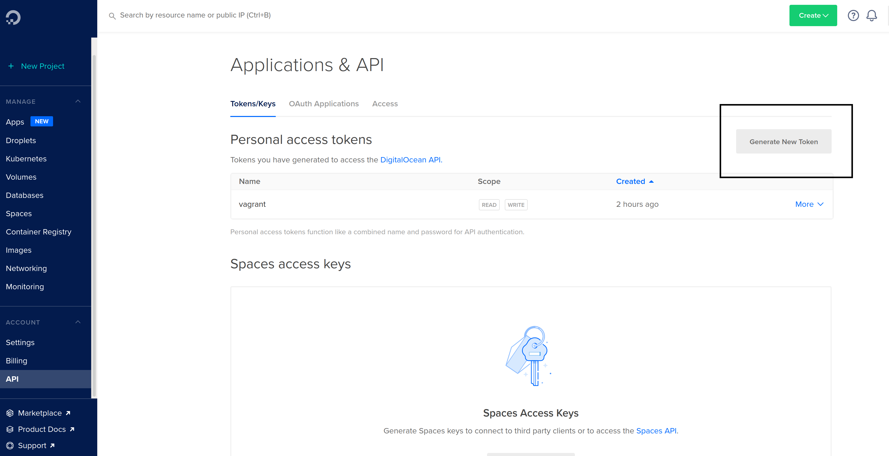

## Digital Ocean Vagrant Automatin Script

This uses https://github.com/devopsgroup-io/vagrant-digitalocean original vagrant file that I modified. Go check them out if you haven't already!

### Instructions and Requirments
- #### Requirments

  1. For this script to work you need to have Vagrant downloaded on your machine. If you don't already have it, head over to https://www.vagrantup.com/ and download it.

  2. Now that you have installed Vagrant we can download the digital ocean vagrant plugin with this command: `vagrant plugin install vagrant-digitalocean`

  3. You now have to head over to https://www.digitalocean.com/ and get an create or use a already created API Token.

     

- #### Instructions
  1. Git clone the repo with: `git clone https://github.com/johnxeast/digital-ocean-vagrant-automation.git`

  2. Run the vagrantscript.py with: `python3 vagrantscript.py`. This will ask you for your Digital Ocean Token, what image you want to use, what region you want the Droplets in, and the size of the machine. It will list Images, Regions, and Sizes for you to select.


```markdown
Syntax highlighted code block

# Header 1
## Header 2
### Header 3

- Bulleted
- List

1. Numbered
2. List

**Bold** and _Italic_ and `Code` text

